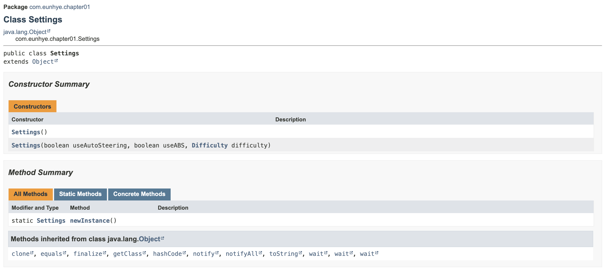
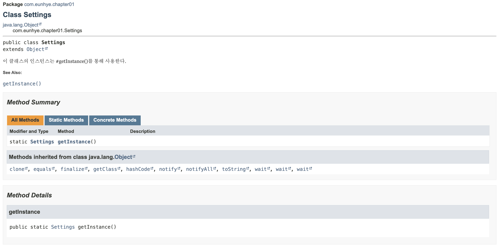

# ITEM 1. 생성자 대신 정적 팩터리 메서드를 고려하라

> **정적 팩터리 메서드와 public 생성자는 각자의 쓰임새가 있으니 상대적인 장단점을 이해하고 사용하는 것이 좋다.<br/>그렇다고 하더라도 정적 팩터리를 사용하는 게 유리한 경우가 더 많으므로 무작정 public 생성자를 제공하던 습관이 있다면 고치자.**

## 장점
  1. [이름을 가질 수 있다.](#장점-1-이름을-가질-수-있다)
  2. [호출될 때마다 인스턴스를 새로 생성하지는 않아도 된다.](#장점-2-호출될-때마다-인스턴스를-새로-생성하지는-않아도-된다)
  3. [반환 타입의 하위 타입 객체를 반환할 수 있는 능력이 있다.](#장점-3-반환-타입의-하위-타입-객체를-반환할-수-있는-능력이-있다)
  4. [입력 매개변수에 따라 매번 다른 클래스의 객체를 반환할 수 있다.](#장점-4-입력-매개변수에-따라-매번-다른-클래스의-객체를-반환할-수-있다)
  5. [정적 팩터리 메서드를 작성하는 시점에는 반환할 객체의 클래스가 존재하지 않아도 된다.](#장점-5-정적-팩터리-메서드를-작성하는-시점에는-반환할-객체의-클래스가-존재하지-않아도-된다)

## 단점
  1. [상속을 하려면 public이나 protected 생성자가 필요하니 정적 팩터리 메서드만 제공하면 하위 클래스를 만들 수 없다.](#단점-1-상속을-하려면-public이나-protected-생성자가-필요하니-정적-팩터리-메서드만-제공하면-하위-클래스를-만들-수-없다)
  2. [정적 팩터리 메서드는 프로그래머가 찾기 어렵다.](#단점-2-정적-팩터리-메서드는-프로그래머가-찾기-어렵다)

**여기서 말하는 정적 팩터리 메서드는 디자인 패턴의 "추상팩토리 패턴"이나 "팩토리 메서드 패턴"과는 무관하다.

<br/><br/><br/>

## 장점 1. 이름을 가질 수 있다.
- 생성자에 넘기는 매개변수와 생성자 자체만으로는 반환될 객체의 특성을 제대로 설명하지 못한다. 반면 정적 팩터리 메서드는 이름만 잘 지으면 반환될 객체의 특성을 쉽게 묘사할 수 있다.
- 또한 생성자는 이름을 설정할 수 없기 때문에 하나의 시그니처로는 하나의 생성자만을 가질 수 있게되며, 클래스 타입만을 반환할 수 있다.
    ```java
    /** 오류코드 **/
    /** 생성자는 컴파일러가 매개변수 이름에 상관없이 시그니처(선언부)까지만 확인하기 때문에 컴파일 오류가 발생한다. **/
        
      public class Order{
          private boolean prime;
          private boolean urgent;
          private Product product;
        
          public Order(Product product, boolean prime) {
              this.product = product;
              this.prime = prime;
          }
        
          public Order(Product product, boolean urgent) {
              this.product = product;
              this.urgent = urgent;
          }
        
        }
    ```
    ```java
    /** 위 코드의 오류 해결, 권장 코드 X  **/
    /** 매개변수의 순서를 변경하거나 매개변수를 추가로 입력하여 오류 수정 **/
  
    public class Order{
        private boolean prime;
        private boolean urgent;
        private Product product;
        
        public Order(Product product, boolean prime) {
            this.product = product;
            this.prime = prime;
        }
        
        // 매개변수 순서 변경
        public Order(boolean urgent, Product product) {
            this.product = product;
            this.urgent = urgent;
        }
        
        // 매개변수 추가
        public Order(Product product, boolean prime, boolean urgent) {
            this.product = product;
            this.prime = prime;
            this.urgent = urgent;
        }
        
    }
    ```
    ```java
    /** 정적 팩토리 매서드 사용  **/
    /** 시그니처나 반환값의 제약이 없다. **/
  
    public class Order{
        private boolean prime;
        private boolean urgent;
        private Product product;
        
        public static Order primeOrder(Product product) {
            Order order = new Order();
            order.prime = true;
            order.product = product;
            return order;
        }
        
        public static Order urgentOrder(Product product) {
            Order order = new Order();
            order.urgent = true;
            order.product = product;
            return order;
        }
        
    }
    ```
  - 위와 같이 매개변수의 순서를 변경하거나, 매개변수를 추가로 입력한다면 생성자에서 발생하는 오류는 피할 수있지만 바람직한 코드는 아니다. 이처럼 생성자의 시그니처가 중복되는 경우 정적 팩터리 메서드를 고려해보면 좋다.

## 장점 2. 호출될 때마다 인스턴스를 새로 생성하지는 않아도 된다.
- 경우에 따라서는 어떤 인스턴스를 매번 만들지 혹은 특정한 경우애만 새로 만들지 통제해야할 필요가 있는데, 자바의 생성자는 매번 호출할 때마다 새로운 인스턴스를 만들어 이를 통제할 수가 없다.
- 정적 팩토리 매서드는 반복되는 요청에 같은 객체를 반환하는 식으로 언제 어느 인스턴스를 살아 있게 할지를 철저히 통제할 수 있다.
    ```java
    /** 정적 팩토리 메서드 예시 **/
    /** 정적 팩토리 메서드 선언 **/
        
      public class Settings {
        private boolean useAutoSteering;
        private boolean useABS;
        private Difficulty difficulty;
        
        // 기본 생성자를 private로 선언
        private Settings() {}
        // 인스턴스 생성
        private static final Settings SETTINGS = new Settings();
        // 정적 팩토리 형태로 인스턴스 제공
        public static Settings getInstance() {
            return SETTINGS;
        }
        
    }
    ```
    ```java
    /** 정적 팩토리 메서드 예시 **/
    /** 정적 팩토리 메서드 호출, settings1과 setting2는 같은 값이 출력됨 **/
  
    public class Product {
        
        public static void main(String[] args) {
            Settings settings1 = Settings.getInstance();
            Settings settings2 = Settings.getInstance();
            
            System.out.println(settings1);
            Systme.out.println(settings2);
        }
    }
    ```
    ```java
    /** valueOf 함수  **/
    /** 파라미터에 따라 미리 만들어 놓은 상수를 반환해 주는 예시 **/
  
    public class Product {
        
        public static void main(String[] args) {
        
        Boolean.valueOf(true);   // Boolean TRUE = new Boolean(true) 반환
        Boolean.valueOf(false);  // Boolean FALSE = new Boolean(false) 반환
        
        }
    }
    ```
  - 위 코드 처럼 정적 팩터리 메서드를 사용하면 매개변수에 따라 각기 다른 인스턴스를 반환하는 것도 가능함을 보여준다.
  - 추가로 책에서는 Flyweight 패턴을 언급하고 있는데, 해당 패턴은 우리가 자주 사용하는 인스턴스인 폰트를 예시로 들 수 있다. 폰트는 설정에서 변경할 때, 매번 새로운 폰트를 만드는 것이 아닌 기존에 미리 만드렁져 있는 폰트를 가져오는 식으로 사용하는 편이다. 이처럼 자주 사용하는 값들을 미리 캐싱해서 넣어놓고 꺼내어 쓰는 형식의 디자인 패턴을 Flyweight 패턴이라 한다.

## 장점 3. 반환 타입의 하위 타입 객체를 반환할 수 있는 능력이 있다.
- 생성자는 인터페이스 선언 시 각자 해당하는 클래스만 반환할 수 있지만 정적 팩터리 메서드를 사용하면 원하는 클래스(하위클래스 포함)나 인터페이스를 반환할 수도 있게된다.(=유연성이 생긴다.)
    ```java
    /** 생성자 클래스 선언  **/
  
    public class EnglishHelloService implements HelloService {
        
        @Override
        public String hello() {
            return "hello";
        }
        
    }
    ```
    ```java
    /** 생성자 클래스 선언  **/
  
    public class KoreanHelloService implements HelloService {
        
        @Override
        public String hello() {
            return "안녕하세요.";
        }
        
    }
    ```
    ```java
    /** 정적 팩터리 매서드 클래스 선언  **/
  
    public class HelloServiceFactory {
        
        public static HelloService of(String lang) {
            if (lang.equals("ko")) {
                return new KoreanHelloService();
            } else {
                return new EnglishHelloService();
            }
        }
        
    }
    ```

## 장점 4. 입력 매개변수에 따라 매번 다른 클래스의 객체를 반환할 수 있다.
- 정적 팩터리 메서드를 사용면 구체적인 인스턴스 타입을 숨길 수 있다는 장점도 있다.
    ```java
    /** 정적 팩터리 매서드 클래스 사용  **/
    /** 구체적인 인스턴스 타입이 드러나지 않는다. **/
  
    public class Product {
        
        public static void main(String[] args) {
            HelloService ko = HelloServiceFactory.of("ko");
        }
        
    }
    ```
- 위 세번째 장점 때 선언했던 코드에서는 `HelloService` 함수를 팩토리 클래스를 따로 만들어서 그 안에 선언했다. `자바 8` 이전에는 인터페이스에서는 static선언을 할 수가 없어서 위와 같은 코드로 작성할 수밖에 없는데 `자바 8` 이후부터 인터페이스 내부에서의 static선언이 가능해져서 아래와 같은 구현도 가능하다.

  ```java
  public interface HelloService {
        
      String hello();
        
      static HelloService of(String lang) { // 인터페이스에 선언한 함수는 private을 붙이지 않는 한 기본적으로 Public이다.
          if (lang.equals("ko")) {
              return new KoreanHelloService();
          } else {
              return new EnglishHelloService();
          }
      }
        
  }
  ```
  ** 인터페이스내에서 변수나 함수 선언 시 접근 제한자를 붙이지 않으면 기본적으로 public으로 간주한다.(일반클래스에서는 protected)

    ```java
    public class Product {
        
        public static void main(String[] args) {
            HelloService ko = HelloService.of("ko");
            System.out.println(ko.hello()); // 실행결과 : 안녕하세요.
        }
        
    }
    ```

## 장점 5. 정적 팩터리 메서드를 작성하는 시점에는 반환할 객체의 클래스가 존재하지 않아도 된다.
- 위에 선언했던 클래스와 상관없이 아래 구현체가 없는 인터페이스 코드만 있다고 가정해보자

   ```java
   package com.eunhye.study;
   
   public interface HelloService {
       
       String hello();
       
   }
   ```
  1. 다른 프로젝트의 resources/META-INF/service/{실행 프로젝트 HelloService의 풀패키지경로} 파일을 만들고 아래와 같이 선언
     <br/>파일명 예시 : com.eunhye.study.HelloService
     ```java
     // {실행 프로젝트가 아닌 다른 프로젝트 패키지경로}.구현체이름
     com.eunhye.test.hello.ChineseHelloService
     ```
  2. 위에 선언한 경로에 구현체 작성(실행 프로젝트가 아닌 다른 프로젝트)
     ```java
     package com.eunhye.test.hello;
   
     public class ChineseHelloService implements HelloService {
       
         @Override
         public String hello() {
             return "Ni Hao";
         }
       
     }
     ```
  3. 구현체가 선언되어있는 프로젝트를 jar로 패키징 후 해당 jar파일을 실행하고자 하는 프로젝트의 pom.xml에 추가
     ```xml
     <dependency>
         <groupId>com.eunhye.test.hello</groupId>
         <artifactId>chinese-hello-service</artifactId>
         <version>0.0.1-SNAPSHOT</version>
     </dependency>
     ```
  4. 실행하고자 하는 프로젝트에서 `ServiceLoader` 를 활용해 코드 작성
     ```java
     package com.eunhye.study;
     
     public class Product {
         
         public static void main(String[] args) {
             ServiceLoader<HelloService> loader = ServiceLoader.load(HelloService.class);
             Optional<HelloSerive> helloServiceOptional = loader.findFirst();
             helloServiceOptional.ifPresent(h -> {
                     System.out.println(h.hello()); // 실행 결과 : Ni Hao
             });
             
         }
         
     }
     ```
  ** `ServiceLoader`는 iterator이다. load하는 순간 자바는 현재 참조할 수 있는 클래스 패스 내에 있는 모든 HelloService의 구현체를 가져온다. 구현체로 등록이 되있으면 가져오는 것이다.
<br/>
<br/>
- 마지막에 아래와 같이 코드를 작성해도 실행 결과는 같다. 하지만 아래의 코드는 `ChineseHelloService` 에 의존적이 되어버리는데, `ChineseHelloService` 를 import 해야만 사용할 수 있기 때문이다.
- 위의 코드에서는 `HelloSerive` 의 구현체가 어떤 것이 올지 모르는 상태로 진행이 되는 것이고 아래의 코드는 정확히 `ChineseHelloService` 구현체를 사용한다고 명확하게 명시하고 진행되는 것이기 때문에 위의 코드가 더 유연한 코드라고 할 수 있다.

   ```java
   package com.eunhye.study;
   
   import com.eunhye.test.hello.ChineseHelloService;
   
   public class Product {
       
       public static void main(String[] args) {
           HelloService helloService = new ChineseHelloService();
           System.out.println(helloService.hello());
       }
       
   }
   ```

- 즉 어떤 구현체가 올지 모르는 상황에서 해당 구현체가 따르고 있는 인터페이스 기반으로 코드를 작성하고 싶다면 `ServiceLoader` 이용한 코드와 같이 작성하면 된다. 책에서도 설명하듯 가장 가까운 예로는 JDBC 드라이버가 있다.
<br/> 
** 예시로 JDBC로더를 들었지만 JDBC로더는 안타깝게도 자바의 `ServiceLoader`가 등장하기 전에 나와서 `ServiceLoader`가 적용되어있지는 않다.

## 단점 1. 상속을 하려면 public이나 protected 생성자가 필요하니 정적 팩터리 메서드만 제공하면 하위 클래스를 만들 수 없다.
- 정적 팩토리만을 사용하도록 클래스를 생성하면 생성자를 private로 선언해야하기 때문에 상속을 허용하지 않게 된다.
    ```java
    public class Settings {
        private boolean useAutoSteering;
        private boolean useABS;
        private Difficulty difficulty;
        
        // 기본 생성자를 private로 선언
        private Settings() {}
        // 인스턴스 생성
        private static final Settings SETTINGS = new Settings();
        // 정적 팩토리 형태로 인스턴스 제공
        public static Settings newInstance() {
            return SETTINGS;
        }
        
    }
    ```
- 생성자를 private로 막지 않고 정적 팩토리 메서드를 제공할 수도 있는데 대표적인 예로 아래와 같은 List가 있다.
  ```java
  public class Product {
        
      public static void main(String[] args) {
            
          List<String> list = new ArrayList<>();  // 생성자를 통해 List 생성
          List.of("item1", "item2");  // of는 정적 팩토리 메서드가 있어 실질적으로 구현체는 Array List가 아닐 수도 있다.
        
      }
  }
  ```

## 단점 2. 정적 팩터리 메서드는 프로그래머가 찾기 어렵다.
- 소스코드를 작성한 후 자바독을 이용해 다큐먼트를 생성할 수 있다. (`mvn javadoc:javadoc`)
   ```java
   public class Settings {
       private boolean useAutoSteering;
       private boolean useABS;
       private Difficulty difficulty;
       
       // 생성자
       public Settings() {}
       
       public Settings(boolean useAutoSteering, boolean useABS, Difficulty difficulty) {
           this.useAutoSteering = useAutoSteering;
           this.useABS = useABS;
           this.difficulty = difficulty;
       } 
       
       // 인스턴스 생성
       private static final Settings SETTINGS = new Settings();
       // 정적 팩토리 형태로 인스턴스 제공
       public static Settings getInstance() {
           return SETTINGS;
       }
       
   }
   ```

  - 자바독 생성 시, 생성자는 생성자의 영역이 따로 존재하여 인스턴스를 어떻게 생성할 수 있는 지를 한 눈에 볼 수 있는 반면 정적 팩토리 매서드는 메서드 부분에 들어가 있어 해당 클래스에서 제공하는 메서드가 많아지는 경우 인스턴스를 생성해주는 용도의 메서드를 찾기가 어렵게 될수도 있다.
    

  - 이에 책에서는 네이밍 패턴을 사용하여 알아보기 쉽게 하는 것과 문서화를 제안하고 있다. 문서화의 예시는 아래와 같다.
     ```java
     /**
     * 이 클래스의 인스턴스는 #getInstance()를 통해 사용한다.
     * @see #getInstance()
     */
     
     public class Settings {
         private boolean useAutoSteering;
         private boolean useABS;
         private Difficulty difficulty;
         
         // 생성자
         private Settings() {}
         
         // 인스턴스 생성
         private static final Settings SETTINGS = new Settings();
         // 정적 팩토리 형태로 인스턴스 제공
         public static Settings getInstance() {
             return SETTINGS;
         }
         
     }
     ```
    
